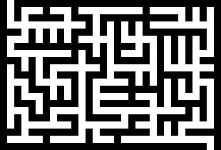

# Lamaso
Maze generator and solver
## How to compile
1. Clone/download repository.
2. Either run build.ps1 with PowerShell (Windows environment), or build and install files with CMake.
## How to use the application
Run the application, then choose any of the following commands.
### Command 1 (New maze)
A *maze* is a rectangular table containing cells which may or may not be separated by walls. A *tree maze* is a maze in which walls are placed such that each two cells are connected with exactly one path (the maze has no loops and has no isolated regions). Below is an example of a 10 x 15 tree maze:

The following data have to be entered to construct a maze:
- *Seed:* Can be any 32-bit signed integer.
- *Path file:* Any 1-bit BMP file containing a path (such as the file produced with Command 2). In the resulting maze, cells of the path will be connected.
- *Height, width:* If path file is provided, maze dimensions are obtained from the path file. Otherwise, maze height and width (32-bit unsigned integers) have to be entered manually.
- *Create tree maze:* Enter *y* if creating tree maze (preferred), otherwise enter *n*.
- *Probability set:* If *tree maze* is selected, the maze is constructed according to 6 probability values, which can be either set by default (select *y* when asked if apply default probability set) or entered manually (select *n*, then enter six unsigned 8-bit integers).
- *Maze file:* After maze is constructed, enter the output BMP file or leave blank if no saving.
### Command 2 (New path)
A *path* in a rectangular *m* x *n* table is a connection (path) between two cells in the table. Cells in the table are represented by pairs (*i*, *j*), where *i* is the row index (between 0 and *m* - 1) and *j* is the column index (between 0 and *n* - 1). Below is an example of a 10 x 15 path between the upper left corner cell (0, 0) and the lower right corner cell (9, 14):

To create a path, the following data have to be entered:
- *Height, width:* Path table dimensions (32-bit unsigned integers).
- *Start row, start column, end row, end column:* Starting and ending point of the path.
- *Seed:* Can be any 32-bit signed integer.
- *Persistency chain length:* The path is generated by a random walk algorithm. If persistency chain length (unsigned 16-bit integer) is nonzero (say, equal to *k*), the algorithm memorizes past *k* decisions in the random walk and, with a certain probability, chooses the new direction with probabilities proportional to shares of directions in the past *k* decisions.
- *Persistency strength:* Relevance of the past decisions. If the past decision chain length is *k* and persistency strength is *r*, then the product *kr* is compared to a random 16-bit unsigned integer. If the random integer is less than *kr* then the new direction is chosen randomly from the past decisions chain, otherwise it is taken randomly from all legal directions.
- *Path file:* After path is constructed, enter the output BMP file or leave blank if no saving.
### Command 3 (Solve maze)
Find a path between two cells in a maze. To execute the command, the following data have to be entered:
- *Maze file name:* Any 1-bit BMP file containing a maze (such as the file produced with Command 1).
- *Start row, start column, end row, end column:* Starting and ending cell of the path to be found.
- *Path file name:* After the maze is solved, enter the output BMP file to save the path or leave blank if no saving.

Last change: March 2022
